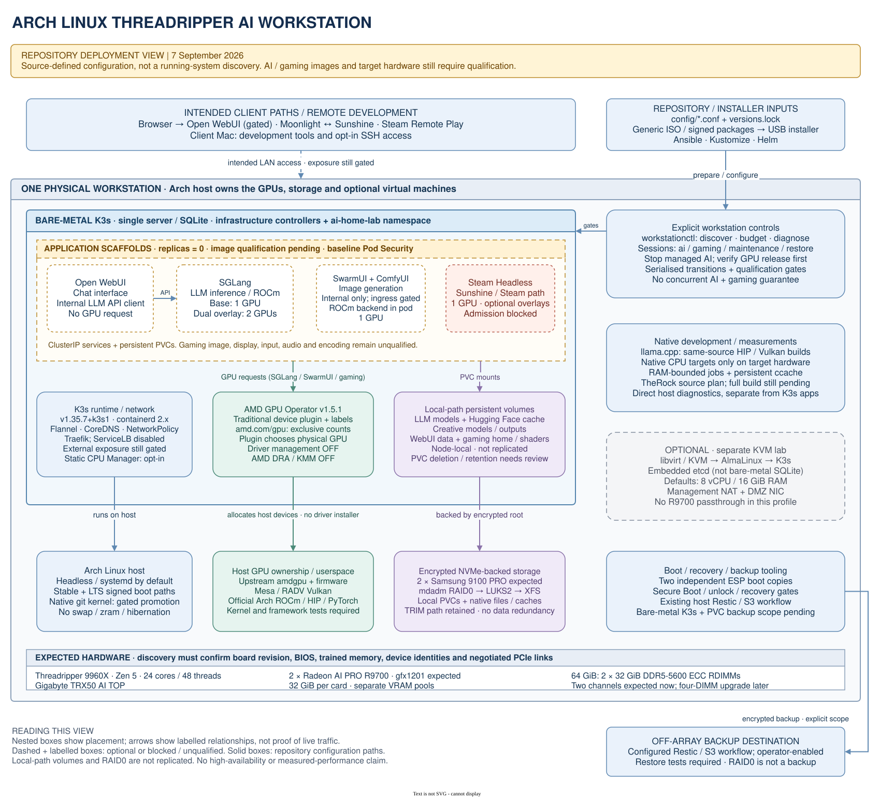

# Workstation stack overview

This deployment view describes the repository configuration on 2026-09-07. It
helps the workstation owner locate the AI, gaming, host, storage and optional
VM layers. It does not describe a discovered running installation.

This dated installer view does not include the later Bridge management plane,
client agent harnesses or RAG extension. The expanded cross-repository views are
in `docs/STACK.md` of the `Spry.ai-workstation-bridge` repository. Keep the source
revision and qualification boundaries of each view distinct.



[Open the PNG preview](diagrams/workstation-stack.png) or edit the authoritative
[draw.io source](diagrams/workstation-stack.drawio). SVG and PNG are generated
outputs. Edit the source and regenerate both previews; do not edit them separately.

## Important boundaries

- The primary AI deployment is bare-metal K3s on Arch. The optional AlmaLinux
  K3s VM is a separate lab with its own datastore and network boundaries.
- Application replicas default to zero. AI images remain unqualified. Gaming
  is optional and its requested `SYS_ADMIN` capability conflicts with the
  namespace's baseline Pod Security policy. No diagram arrow removes those gates.
- Open WebUI calls the internal SGLang OpenAI-compatible API. SwarmUI expects
  an in-pod ROCm ComfyUI backend; its ClusterIP service remains internal and
  default-deny NetworkPolicy blocks ingress. A private access path is not yet
  configured. Sunshine serves Moonlight; Steam Remote Play is an alternative
  streaming path. External access still needs qualification.
- Arch owns `amdgpu`. The AMD operator manages the traditional device plugin
  and labels, not host driver installation. `amd.com/gpu` requests allocate
  exclusive device counts; they do not select a known physical R9700. The two
  cards have separate VRAM pools. Neither labels nor this view prove peer DMA.
- The explicit session command stops managed GPU workloads and verifies release
  before starting the selected workload. It does not implement simultaneous
  one-GPU AI and one-GPU gaming. New managed builds are inhibited during gaming;
  already-running or unrelated builds are not stopped automatically.
- The expected two-DIMM population is not a measured channel or trained-speed
  result. Recollect hardware and regenerate resource budgets after an upgrade.
- Node-local PVCs, native caches and files use the encrypted NVMe-backed root.
  PVC size requests are not filesystem quotas. RAID0 has no data redundancy;
  the second ESP provides another boot copy, not another copy of root data.
- The repository documents a host Restic/S3 backup workflow. It does not yet
  include bare-metal K3s database/token and PVC paths in that host backup scope.
  The intended NAS destination is not shown as implemented: confirm and
  configure the chosen off-array destination separately.

The view omits the retained Intel-only legacy commands, detailed port rules,
individual PVC sizes and family account overlays. See the linked source guides
for those details. Solid boxes identify repository configuration paths, not
qualified deployment status. Dashed boxes also carry an explicit optional,
blocked or unqualified label; colour alone does not convey status.

## Source map

| Diagram area | Repository evidence |
| --- | --- |
| Installation, headless host and boot | [Architecture](ARCHITECTURE.md), [host example](../infrastructure/host/install.conf.example), [ISO workflow](ISO.md) |
| K3s runtime and networking | [Home-lab guide](HOME-LAB.md), [K3s configuration template](../infrastructure/ansible/roles/k3s_baremetal/templates/config.yaml.j2) |
| GPU operator and driver ownership | [values.yaml](../infrastructure/gpu-operator/values.yaml), [DeviceConfig](../infrastructure/gpu-operator/deviceconfig.yaml), [chart lock](../infrastructure/gpu-operator/chart.lock) |
| AI applications and internal API | [SGLang](../apps/base/sglang/deployment.yaml), [Open WebUI](../apps/base/open-webui/deployment.yaml), [SwarmUI](../apps/base/swarmui/deployment.yaml) |
| Gaming and admission | [Steam Headless](../apps/base/steam-headless/deployment.yaml), [namespace policy](../apps/base/namespace.yaml), [home-lab guide](HOME-LAB.md) |
| Sessions and resource/build gates | [session implementation](../lib/workstation/session.sh), [workstation configuration](../config/workstation.conf.example), [AI audit](AI-PERFORMANCE.md) |
| Native tools and qualification | [ROCm guide](ROCM.md), [host packages](../templates/workstation/packages.pacman), [version lock](../versions.lock) |
| Storage, backups and optional VM | [Architecture](ARCHITECTURE.md), [home-lab guide](HOME-LAB.md), [operations](OPERATIONS.md) |

## Regenerate the previews

Use an existing draw.io desktop CLI. The original previews used draw.io 31.3.2;
the 2026-09-08 validation used 31.4.4. XML/reference/geometry checks, fresh SVG
and PNG exports, and visual inspection passed. These commands only render local
diagram files; they do not run the installer or contact a cluster. From the
repository root:

```sh
xmllint --nonet --noout docs/diagrams/workstation-stack.drawio
drawio --disable-update --export --format svg --theme light --embed-svg-fonts false --border 20 --output docs/diagrams/workstation-stack.svg docs/diagrams/workstation-stack.drawio
drawio --disable-update --export --format png --theme light --scale 1.5 --border 20 --output docs/diagrams/workstation-stack.png docs/diagrams/workstation-stack.drawio
```

Inspect the rendered previews after changes. XML parsing alone does not verify
layout or application acceptance. The diagram uses generic local shapes and
fonts; it requires no downloaded icons or remote images.
